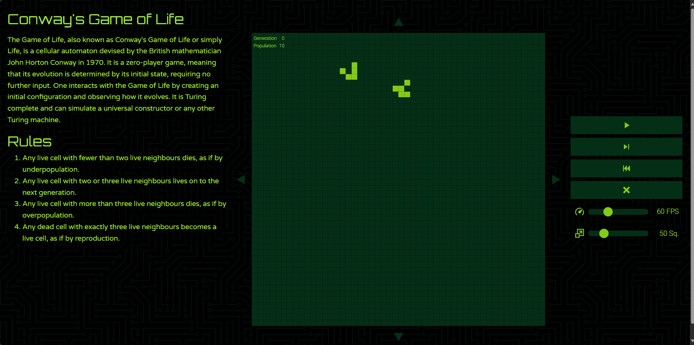

# Conway's Game of Life

A web application to run Conway's Game of Life, a cellular automaton developed by the British mathematician John Horton Conway in 1970.

## Demo

## Features

- Infinite Exploration: The cell simulation is not bounded by grid region enabling users to explore endlessly using the arrow buttons.
- Simulation Speed Control: Adjust the simulation speed with the frames per second (FPS) slider for a customized experience.
- Grid Size Control: Change the display grid size using the adjustable slider.
- Interactive State: Change the state of the cells by clicking on them.
- Game Status Display: The current generation number and population number are on display.
- Mobile Friendly: Dynamic layout design for mobile screen support.
- Keyboard Support: Navigate the grid using arrow keys and start/stop the simulation with the ENTER key.

## What I learned from the project

- Gained experience in DOM manipulation using plain JavaScript.
- Explored design patterns, including Factory Functions and the Module Pattern.

## Live Preview

Click [here](https://zukurai-kushal.github.io/game-of-life/) to view the live page.
